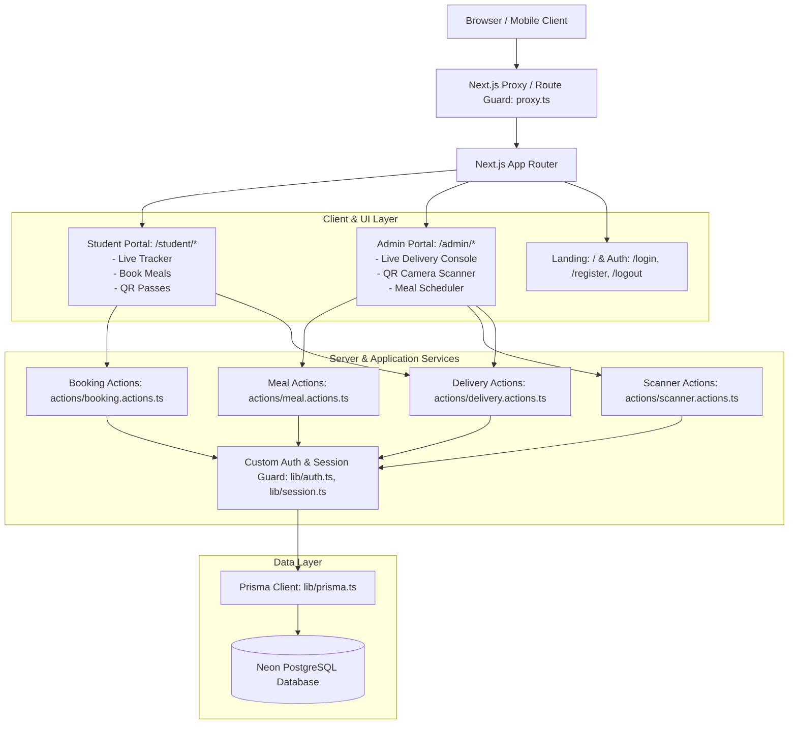
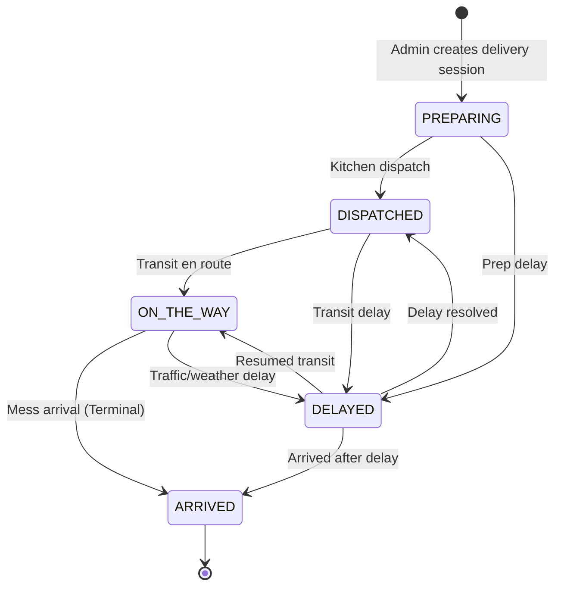

# System Architecture: Hostel Food Delivery & QR Food Collection System

## 1. Architectural Overview

The Hostel Food Delivery & QR Food Collection System is a unified, full-stack monolith powered by the **Next.js 16 App Router** with **TypeScript**, **Custom Authentication (bcryptjs + HTTP-only session cookies)**, and **Neon PostgreSQL via Prisma ORM**. It combines two mission-critical campus operations:
1. **Live Hostel Food Delivery Tracking:** Enforced finite state machine (`PREPARING` → `DISPATCHED` → `ON_THE_WAY` → `ARRIVED`, with `DELAYED` branch) with delay alerts and historical punctuality logs.
2. **Food Booking & QR Collection:** Meal booking with time windows, duplicate booking prevention, opaque cryptographically generated QR passes, and atomic warden camera scanning with double-collection protection.



---

## 2. Directory Structure

```text
MEALBITE/
├── .agents/                    # Agent persistent memory & operational rules
│   ├── README.md
│   ├── PROJECT_CONTEXT.md
│   ├── ARCHITECTURE.md
│   ├── DEVELOPMENT_RULES.md
│   ├── DATABASE_RULES.md
│   ├── UI_RULES.md
│   └── PROGRESS.md
├── actions/                    # Next.js Server Actions (mutations & data fetching)
│   ├── auth.actions.ts         # Custom login, register, logout, session check
│   ├── booking.actions.ts      # Meal booking, passes, student history, auto-seeding
│   ├── delivery.actions.ts     # Delivery state machine, live tracking, stats, alerts
│   ├── meal.actions.ts         # Admin meal creation, schedule & availability management
│   └── scanner.actions.ts      # Atomic QR verification & food collection
├── app/                        # Next.js App Router
│   ├── (auth)/                 # Custom authentication routes
│   │   ├── login/page.tsx      # Email & password login
│   │   └── register/page.tsx   # Student account registration
│   ├── admin/                  # Protected Warden / Admin Management
│   │   ├── bookings/page.tsx   # All bookings & real-time collection status
│   │   ├── dashboard/page.tsx  # Unified KPI dashboard (bookings + deliveries)
│   │   ├── deliveries/page.tsx # Active delivery state machine controls
│   │   ├── history/page.tsx    # Filterable delivery audit log
│   │   ├── layout.tsx          # Server-side requireAdmin() guard
│   │   ├── meals/page.tsx      # Daily meal & booking window management
│   │   └── scanner/page.tsx    # In-browser QR camera scanner + manual input
│   ├── api/                    # Route Handlers
│   │   └── health/route.ts     # Health check & database ping
│   ├── logout/page.tsx         # Secure session destruction & redirect
│   ├── student/                # Protected Student Portal
│   │   ├── book/page.tsx       # Daily meal booking view with countdown
│   │   ├── bookings/page.tsx   # Active meal passes & past booking history
│   │   ├── dashboard/page.tsx  # Live delivery tracker, active passes, delay banners
│   │   ├── history/page.tsx    # Delivery punctuality history
│   │   ├── layout.tsx          # Server-side requireAuth() guard
│   │   └── pass/[id]/page.tsx  # Individual QR food collection pass
│   ├── error.tsx               # Client error boundary
│   ├── globals.css             # Tailwind CSS styles
│   ├── layout.tsx              # Root layout (Navbar, MobileNav, session resolution)
│   ├── loading.tsx             # Global loading skeleton
│   ├── not-found.tsx           # 404 page
│   ├── page.tsx                # Landing page with dynamic session status
│   └── unauthorized/page.tsx   # Access forbidden handler
├── components/                 # Reusable UI Components
│   ├── admin/                  # CreateDeliveryModal, DeliveryControlCard, QrScanner, CreateMealModal
│   ├── booking/                # MealBookingButton
│   ├── delivery/               # DelayAlertBanner, DeliveryTimeline, DeliveryHistoryTable
│   ├── layout/                 # Navbar, MobileNav
│   └── ui/                     # Button, Card, Badge
├── lib/                        # Core Utilities & Singletons
│   ├── auth.ts                 # getCurrentUser(), requireAuth(), requireAdmin(), requireRole()
│   ├── password.ts             # bcryptjs password hashing and verification
│   ├── session.ts              # HTTP-only session cookie creation and invalidation
│   ├── prisma.ts               # PrismaClient connection singleton
│   └── utils.ts                # cn helper, date & time formatters
├── prisma/                     # Database Schema & Migrations
│   ├── migrations/             # Neon PostgreSQL SQL migration history
│   └── schema.prisma           # Prisma schema (User, Session, Meal, Booking, Delivery, Notification)
├── proxy.ts                    # Edge proxy route guard for Next.js 16
├── scripts/                    # Maintenance & Setup Scripts
│   └── create-admin.ts         # Secure CLI script: npm run create-admin
├── test/                       # Verification Test Suites
│   ├── auth-role.test.ts       # Role resolution & password hashing tests
│   └── prisma-system.test.ts   # Neon PostgreSQL integration tests
├── types/                      # TypeScript Definitions
│   ├── delivery.ts             # Meal, Booking, Delivery, Status enums & interfaces
│   ├── index.ts                # Consolidated re-exports
│   └── user.ts                 # UserRole & UserSessionProfile definitions
├── package.json
└── tsconfig.json               # Strict TypeScript config
```

---

## 3. QR Food Collection & Double-Collection Protection

### 3.1 Opaque QR Token Generation
When a student books a meal, an opaque cryptographically random 48-character hex token is generated server-side using `crypto.randomBytes(24).toString('hex')`.
- **Zero Student PII in QR:** The QR payload does not expose student ID, room number, or email.
- **Pass URL & Token:** The QR renders either the verification URL or the raw token, which the warden scans.

### 3.2 Double-Collection Prevention Mechanism
To guarantee that a meal cannot be collected multiple times—even under rapid or concurrent scanning—the collection handler uses an atomic database update:

```typescript
const updateResult = await prisma.booking.updateMany({
  where: {
    qrToken: trimmedToken,
    status: 'BOOKED',
  },
  data: {
    status: 'COLLECTED',
    collectedAt: new Date(),
    collectedBy: warden.name || warden.email,
  },
});
```

- If `updateResult.count === 1`: The state transition was atomically applied. The response returns **Collection Successful** along with student name, room number, and meal details.
- If `updateResult.count === 0`: The booking either does not exist or has already transitioned to `COLLECTED` or `CANCELLED`. A subsequent query checks the current state and returns an immediate rejection:
  > *"ALREADY COLLECTED: This food pass was already collected on [Timestamp] by [Warden]. Multiple collections are strictly prohibited."*

---

## 4. Delivery Status State Machine

The active delivery tracking system maintains its strict finite state machine alongside food bookings:



---

## 5. Security & Isolation Principles

1. **Zero Client-Side Trust:** Roles and user IDs are resolved purely on the server via `getCurrentUser()` querying active sessions in PostgreSQL.
2. **Password Protection:** Plaintext passwords are never stored; passwords are salted and hashed using `bcryptjs`.
3. **Session Security:** Sessions use random 256-bit tokens stored in secure, `HttpOnly`, `SameSite=Lax` cookies with server-side validation and expiration.
4. **Unique Booking Enforcement:** Database level `@@unique([userId, mealId])` guarantees no duplicate bookings can ever be written for the same student on the same meal.
5. **Admin Role Guard:** Only accounts with `role === "ADMIN"` can access `/admin/*` or invoke administrative server actions. Students attempting access are redirected or rejected.
